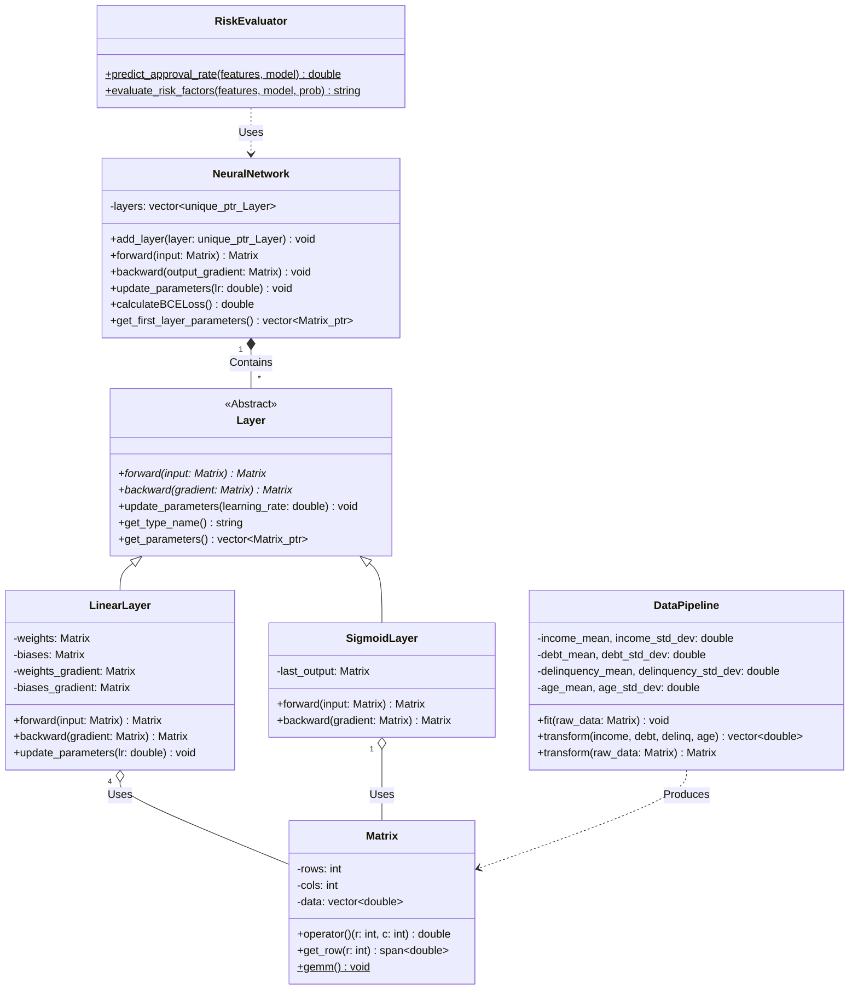
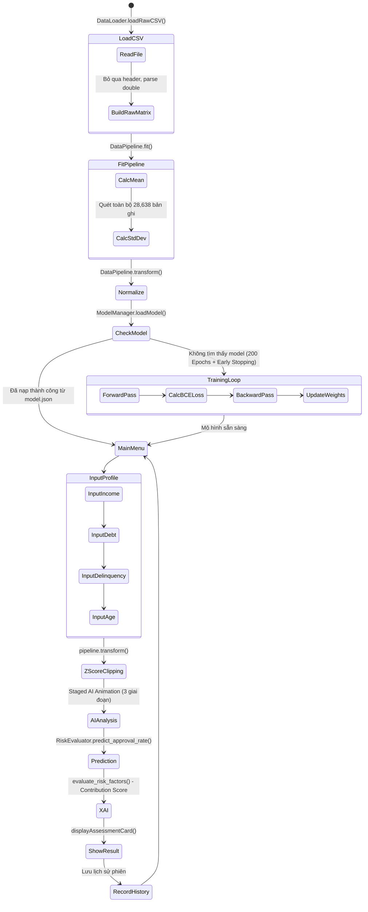

# RiskGuard ML Framework (v2.1)

**RiskGuard ML Framework** là một thư viện học máy (Machine Learning) toán học thuần túy, được tối ưu hóa bằng **C++20**, thiết kế chuyên biệt cho bài toán đánh giá rủi ro tín dụng (Credit Risk Assessment). Dự án tuân thủ nghiêm ngặt nguyên tắc **Zero-dependency** (100% offline, không phụ thuộc thư viện ngoài), đảm bảo tốc độ tính toán tối đa, quản lý bộ nhớ thủ công hiệu quả và bảo mật tuyệt đối.

---

## 🌟 Điểm Mạnh & Tính Năng Nổi Bật

Dự án sở hữu nhiều điểm kỹ thuật ấn tượng, thể hiện tư duy lập trình hệ thống mà nhóm đã cùng tìm tòi kết hợp học máy:

1. **Quản lý bộ nhớ tối ưu (Flat Memory Architecture):** Ma trận (`Matrix`) không dùng `std::vector<std::vector<double>>` (gây phân mảnh bộ nhớ) mà dùng mảng phẳng 1 chiều `std::vector<double> data`. Kỹ thuật này tối ưu hóa **CPU Cache**, giúp các phép toán ma trận nhanh hơn đáng kể.
2. **Thuật toán GEMM (General Matrix Multiply) Mini:** Phép nhân ma trận được viết tay, hỗ trợ tính toán *in-place* với cờ `transposeA` và `transposeB`, giảm thiểu việc khởi tạo vùng nhớ tạm thời trong quá trình backpropagation.
3. **Zero-copy Array Access:** Lấy dữ liệu từng hàng ma trận hoàn toàn không tốn chi phí copy nhờ `std::span`.
4. **Gradient Clipping & Numerical Stability:** Áp dụng `epsilon = 1e-15` để chống lỗi `NaN` khi tính đạo hàm Binary Cross Entropy, kết hợp chặn trần đạo hàm để tránh bùng nổ gradient.
5. **DataPipeline Động (Dynamic Fitting):** Hàm `fit()` tự động tính Mean và Standard Deviation từ dữ liệu thực, triệt tiêu hoàn toàn các tham số hardcode. Chuẩn hóa Z-Score kết hợp kẹp biên `[-3.0, 3.0]` bảo vệ mạng khỏi dị biệt (Outlier).
6. **Explainable AI (XAI):** Hệ thống sinh lý do từ chối/phê duyệt dựa trực tiếp trên **Contribution Score** — tích vô hướng giữa đặc trưng đã chuẩn hóa và trọng số thực của mạng nơ-ron, thay vì dùng `if-else` cứng nhắc.
7. **Huấn luyện Nâng cao (v2.1):** Hỗ trợ **Early Stopping** và **Learning Rate Step Decay** với tối đa 200 epochs. Tự động dừng nếu hàm mất mát không cải thiện, tối ưu thời gian huấn luyện.
8. **Quản lý Mô hình & Lịch sử:** Tự động lưu mô hình vào `model.json` để tải lại mà không cần huấn luyện lại. Theo dõi lịch sử thẩm định chi tiết theo từng phiên làm việc.

---

## 🚀 C++20 vs C++17: Sự đổi mới mà nhóm muốn mang tới

Việc nâng cấp từ C++17 lên **C++20** mang lại các lợi thế mang tính quyết định cho hiệu năng xử lý toán học:

* **`std::span` (Zero-copy View):** Trong C++17, để truyền một hàng của ma trận, ta thường phải copy ra `std::vector` mới, hoặc truyền con trỏ và kích thước thô (dễ gây lỗi bộ nhớ). C++20 `std::span` tạo ra một "khung nhìn" an toàn, chi phí bộ nhớ bằng `0`, giúp truy xuất dữ liệu tuyến tính với hiệu suất tối đa.
* **`std::string_view`:** Được dùng trong `Dashboard::getSafeDouble()` và `getSafeInt()` để truyền chuỗi prompt mà không cần sao chép, giảm overhead ở mỗi lần nhập liệu của người dùng.
* **`[[nodiscard]]` tinh chỉnh:** Giúp compiler cảnh báo lập trình viên nếu quên gán kết quả của `forward()` hoặc `backward()`, một lỗi rất dễ mắc phải khi viết pipeline Deep Learning.
* **Structured Bindings (C++17 → 20):** Được dùng trong `tests/main.cpp` để duyệt tập mẫu kiểm thử một cách tường minh: `for (const auto& [inc, dbt, del, age] : samples)`.

---

## 🏗️ Tư Duy Lập Trình Hướng Đối Tượng (OOP)

Dự án ứng dụng triệt để 4 tính chất của OOP để tạo ra một Framework dễ mở rộng:

1. **Tính Trừu Tượng (Abstraction):**
   Lớp `Layer` là một Abstract Base Class (ABC) với các phương thức thuần ảo (`forward`, `backward`, `update_parameters`). Neural Network chỉ cần giao tiếp với `Layer` mà không cần biết bên dưới là Linear hay Sigmoid. Hệ thống `TestRunner` cũng ẩn đi logic thực thi nội bộ.
2. **Tính Đóng Gói (Encapsulation):**
   Lớp `Matrix` giấu kín mảng `data` một chiều (private) và thuật toán `r * cols + c`. Người dùng bên ngoài chỉ thao tác qua toán tử `operator()(r, c)`. Trạng thái bộ nhớ được bảo vệ an toàn.
3. **Tính Đa Hình (Polymorphism):**
   Trong hàm `NeuralNetwork::forward()`, vòng lặp gọi `layer->forward()`. Tại thời gian thực thi (Runtime), C++ sử dụng VTable để quyết định gọi `LinearLayer::forward` hay `SigmoidLayer::forward` tùy thuộc vào con trỏ thực tế.
4. **Tính Kế Thừa (Inheritance):**
   Các thuật toán (Linear, ReLU, Sigmoid) kế thừa thuộc tính và định nghĩa từ `Layer`. Các lớp kiểm thử (`MatrixMultiplicationTest`) kế thừa cấu trúc từ `TestCase`.

### Sơ Đồ Lớp (Class Diagram)



---

## 🔄 Luồng Dữ Liệu Hoàn Chỉnh (End-to-End Data Flow)

Sơ đồ dưới đây mô tả toàn bộ luồng từ lúc khởi động đến khi đưa ra kết luận XAI:



---

## 🧠 Explainable AI (XAI) — Giải Thích Quyết Định Của Mạng

Đây là tính năng **cốt lõi nhất** được bổ sung trong phiên bản v2.0. Thay vì đưa ra lý do cứng nhắc (hardcode), hệ thống thực sự "đọc tâm trí" mạng nơ-ron:

**Thuật toán Contribution Score:**
```
score_i = feature_normalized[i] × Σ(weights[i][j], j=0..hidden_size)
```

Thuộc tính nào có `score_i` dương lớn nhất → đó là **nguyên nhân cốt lõi** của rủi ro cao. Kết quả sinh ra các lý do như:
- *"Dư nợ hiện tại quá cao, tạo áp lực trả nợ lớn."*
- *"Lịch sử tín dụng xấu, có nhiều lần trễ hạn thanh toán."*
- *"Thu nhập không ổn định hoặc thấp hơn chuẩn an toàn."*

---

## 💾 Kiến Trúc Serialize Dữ Liệu (Lý Thuyết Lưu Trữ JSON)

Để lưu trữ cấu trúc mạng nơ-ron ("bộ não AI") mà không phụ thuộc thư viện ngoài, việc sử dụng định dạng văn bản như **JSON (JavaScript Object Notation)** mang lại sự rõ ràng và dễ tương thích.

**Cách dữ liệu được định hình thành JSON:**
* **Kiến trúc phân cấp:** Mạng nơ-ron chứa một danh sách (Array) các Lớp (Layers). Mỗi lớp mang một cái tên (VD: `"Linear"`, `"Sigmoid"`).
* **Chuyển đổi Ma Trận thành Mảng JSON:** Lớp Linear chứa trọng số (`weights`) và độ lệch (`biases`). Vì kiến trúc `Matrix` của dự án sử dụng mảng phẳng (`vector<double>`), hệ thống chỉ cần lưu số hàng (`rows`), số cột (`cols`), và danh sách phẳng toàn bộ các số thực.

*Ví dụ minh họa cấu trúc JSON lưu trữ:*
```json
{
  "model": "RiskGuard_v2",
  "layers": [
    {
      "type": "Linear",
      "parameters": {
        "weights": { "rows": 4, "cols": 8, "data": [0.12, -0.45, 0.89, "..."] },
        "biases": { "rows": 1, "cols": 8, "data": [0.01, -0.02, "..."] }
      }
    },
    {
      "type": "Sigmoid",
      "parameters": {}
    }
  ]
}
```

**Quy trình Nạp (Deserialization):**
Chương trình sẽ đọc chuỗi ký tự, tìm kiếm các khóa `"rows"` và `"cols"` để tái cấp phát mảng bộ nhớ `Matrix`, sau đó nạp tuần tự danh sách các số thực vào vùng nhớ phẳng (Flat Memory) để tiếp tục tính toán tức thì.

---

## 📂 Cấu Trúc Thư Mục

```text
ML_Guard_OOP_GiuaKy/
├── CMakeLists.txt                      # Cấu hình C++20, build targets, macro RISKGUARD_PROJECT_ROOT
├── README.md                           # Tài liệu thiết kế hệ thống
├── .gitignore                          # Loại trừ build/, binaries, data raw
│
├── include/                            # Public API headers (.hpp only)
│   └── riskguard/
│       ├── core/
│       │   ├── Customer.hpp            # DTO đối tượng khách hàng
│       │   ├── Layer.hpp               # Abstract Base Class (ABC) — Tính Trừu Tượng
│       │   └── Matrix.hpp              # Flat memory matrix, GEMM, std::span
│       ├── layers/
│       │   ├── LinearLayer.hpp         # Fully connected layer (weights + biases)
│       │   └── SigmoidLayer.hpp        # Sigmoid activation với numerical clamping
│       ├── network/
│       │   ├── NeuralNetwork.hpp       # Forward / Backward / BCE Loss + XAI accessor
│       │   └── RiskEvaluator.hpp       # Inference + XAI: evaluate_risk_factors()
│       └── utils/
│           ├── Dashboard.hpp           # Cyberpunk CLI UI & Safe Input (C++20)
│           ├── DataLoader.hpp          # CSV reader thuần thô (loadRawCSV, không scale)
│           └── DataPipeline.hpp        # Z-Score fit/transform + Outlier Clipping [-3,3]
│
├── src/                                # Implementation files (mirror include/)
│   ├── core/
│   │   └── Matrix.cpp                  # GEMM fix (transA/transB), zero-copy span
│   ├── layers/
│   │   ├── LinearLayer.cpp             # Gradient accumulation, gradient clipping
│   │   └── SigmoidLayer.cpp            # Sigmoid forward/backward
│   ├── network/
│   │   ├── NeuralNetwork.cpp           # Pipeline orchestration, get_first_layer_parameters()
│   │   └── RiskEvaluator.cpp           # XAI Contribution Score, dynamic reason generation
│   └── utils/
│       ├── Dashboard.cpp               # Cấu hình ANSI Windows API, Việt hoá hoàn toàn
│       ├── DataLoader.cpp              # loadRawCSV() — chỉ đọc thô, không normalize
│       └── DataPipeline.cpp            # fit() tính thống kê + transform(Matrix) batch
│
├── app/
│   └── main.cpp                        # Entry point: Runtime Training → Cyberpunk CLI → XAI
│
├── tests/                              # Unit Testing Framework (tự viết, không dùng thư viện ngoài)
│   ├── main.cpp                        # Đăng ký & chạy 11 test cases
│   ├── logger.hpp                      # Performance profiler (High Resolution Clock)
│   ├── test_runner.hpp                 # TestCase ABC + TestRunner Singleton + Assert macros
│   ├── test_matrix.cpp                 # 3 test cases: multiply, broadcasting, transpose
│   ├── test_layers.cpp                 # 3 test cases: sigmoid, linear forward, BCE gradient
│   └── test_csv_reader.cpp             # 2 test cases: file not found, raw CSV loader
│
├── data/
│   ├── dataset.csv                     # Processed data (28,638 records, 5 features: Income/Debt/Delinquency/Age/Default)
│   └── raw/
│       └── credit_risk_dataset_raw.csv # Raw data gốc — Nguồn: Kaggle.com
│
└── scripts/
    └── process_data.py                 # Tiền xử lý CSV: làm sạch, encode
```

---

## 🛠️ Hướng Dẫn Cài Đặt (Installation)

Yêu cầu môi trường có hỗ trợ C++20 (GCC 11+ / MSVC 2019+) và CMake 3.20+.

```bash
# 1. Clone repository về máy cục bộ
git clone https://github.com/Yuno-20EA/ML_Guard_OOP_GiuaKy.git
cd ML_Guard_OOP_GiuaKy

# 2. Khởi tạo thư mục build
mkdir build && cd build

# 3. Cấu hình CMake (tự động nhúng RISKGUARD_PROJECT_ROOT)
cmake ..

# 4. Biên dịch ứng dụng chính
cmake --build . --target riskguard

# 5. Biên dịch và chạy bộ kiểm thử
cmake --build . --target riskguard_tests
./riskguard_tests

# 6. Chạy ứng dụng
./riskguard
```

> **Lưu ý:** Đường dẫn `dataset.csv` được giải quyết tự động qua macro `RISKGUARD_PROJECT_ROOT` nhúng bởi CMake — không cần cấu hình thêm.

---

## 💻 Hướng Dẫn Sử Dụng (Usage)

Dưới đây là ví dụ minh họa cách sử dụng API của RiskGuard Framework:

```cpp
#include "riskguard/network/NeuralNetwork.hpp"
#include "riskguard/network/RiskEvaluator.hpp"
#include "riskguard/utils/DataLoader.hpp"
#include "riskguard/utils/DataPipeline.hpp"
#include "riskguard/layers/LinearLayer.hpp"
#include "riskguard/layers/SigmoidLayer.hpp"
#include <memory>

using namespace riskguard;

int main() {
    // 1. Tải dữ liệu thô (không normalize)
    DataLoader loader;
    Matrix raw = loader.loadRawCSV("data/dataset.csv");

    // 2. Tự động học phân phối từ dữ liệu thực
    DataPipeline pipeline;
    pipeline.fit(raw);                      // Tính Mean & StdDev từng thuộc tính
    Matrix normalized = pipeline.transform(raw);  // Z-Score + Clipping [-3,3]

    // 3. Khởi tạo mạng nơ-ron (kiến trúc 4 → 8 → 1)
    NeuralNetwork net;
    net.add_layer(std::make_unique<LinearLayer>(4, 8));
    net.add_layer(std::make_unique<SigmoidLayer>());
    net.add_layer(std::make_unique<LinearLayer>(8, 1));
    net.add_layer(std::make_unique<SigmoidLayer>());

    // 4. Training loop (50 epochs, lr = 0.05)
    Matrix X(/*...*/), Y(/*...*/);
    for (int epoch = 1; epoch <= 50; ++epoch) {
        Matrix pred = net.forward(X);
        Matrix grad = net.calculateBCEGradient(pred, Y);
        net.backward(grad);
        net.update_parameters(0.05);
    }

    // 5. Inference + XAI
    std::vector<double> features = pipeline.transform(50000.0, 5000.0, 0.0, 30);
    double risk = RiskEvaluator::predict_approval_rate(features, net);
    std::string reason = RiskEvaluator::evaluate_risk_factors(features, net, risk);

    return 0;
}
```

---

## 📜 Quy Tắc Quản Lý Kho Lưu Trữ (Repository Rules)

### 1. Chiến lược quản lý Nhánh (Branching Strategy)
* **Tuyệt đối không push trực tiếp lên nhánh `main` hoặc `master`.** Nhánh này phản ánh trạng thái production ổn định, chỉ chứa mã nguồn đã kiểm thử.
* Nhánh **`develop`** là nhánh trung tâm tích hợp. Mọi tính năng mới phải được gộp vào đây trước khi phát hành.
* Áp dụng **Feature Branching**. Tên nhánh tuân theo tiền tố:
  * `feature/ten-tinh-nang` (Ví dụ: `feature/xai-reasoning`)
  * `bugfix/ten-loi` (Ví dụ: `bugfix/fix-csv-path`)

### 2. Quy chuẩn Commit (Commit Messages)
Thông điệp commit phải ngắn gọn, rõ nghĩa (áp dụng **Conventional Commits**):
```text
<loại>: <mô tả ngắn>
```
* `feat`: Thêm tính năng mới
* `fix`: Sửa lỗi
* `docs`: Cập nhật tài liệu (README)
* `style`: Định dạng mã nguồn, Việt hoá giao diện
* `refactor`: Tái cấu trúc mà không thay đổi chức năng

---

## 🤝 Quy Trình Đóng Góp & Duyệt Code (Contributing)

### Bước 1: Tạo Pull Request (PR)
Khi hoàn thành một tính năng, đẩy nhánh lên server và tạo Pull Request hướng về nhánh `develop`.
Đảm bảo code đã vượt qua bộ kiểm thử (`riskguard_tests`).

### Bước 2: Duyệt mã nguồn (Code Review)
Một PR chỉ đủ điều kiện gộp (merge) khi có ít nhất **1 thành viên khác** thẩm định cấu trúc, code style và bấm phê duyệt (**Approve**).

### Bước 3: Giải quyết Xung đột (Conflict Resolution)
Nếu có conflict, người tạo PR phải tự `git pull` nhánh `develop` về máy, giải quyết xung đột, chạy lại test trước khi yêu cầu review lại.

---

## 👥 Thành Viên & Vai Trò (Team Members)

Dự án được phát triển và phối hợp vận hành bởi các thành viên:

* **Nguyễn Hoàng Hải** – *Nhóm trưởng* — *MSV: 25112038*

  Thiết lập kiến trúc hệ thống và cấu trúc thư mục chuẩn. Xây dựng toàn bộ lõi tính toán C++20 (`Matrix`, `Layer`, `LinearLayer`, `SigmoidLayer`, `NeuralNetwork`).

  **Đóng góp kỹ thuật trong phiên nâng cấp v2.0:**
  - Tái kiến trúc `DataPipeline` với hàm `fit()` tự động học Mean/StdDev từ dữ liệu thực, loại bỏ hoàn toàn các tham số hardcode.
  - Thêm hàm `transform(Matrix)` để chuẩn hóa toàn bộ tập huấn luyện theo cùng một bộ Z-Score, đồng bộ với pipeline dự đoán.
  - Cải tiến `DataLoader` đổi sang `loadRawCSV()`, loại bỏ Min-Max Scaling lệch pha, giải quyết Distribution Mismatch nghiêm trọng.
  - Tích hợp **Runtime Training**: mô hình huấn luyện tự động 50 Epochs từ `dataset.csv` ngay khi khởi động, kèm thanh tiến trình hoạt hoạ.
  - Triển khai **Explainable AI (XAI)** trong `RiskEvaluator::evaluate_risk_factors()`: tính Contribution Score từ trọng số lớp 1 của mạng để xác định thuộc tính gây rủi ro cao nhất.
  - Bổ sung `NeuralNetwork::get_first_layer_parameters()` để XAI có thể đọc trực tiếp tham số mạng.
  - Sửa lỗi **Absolute Path** cho `dataset.csv` bằng macro CMake `RISKGUARD_PROJECT_ROOT`, đảm bảo chương trình chạy đúng dù được gọi từ bất kỳ thư mục nào.
  - Nâng cấp bộ Unit Test lên 11 test cases, bao gồm `XAIEvaluationTest` kiểm tra tính đúng đắn của thuật toán giải thích.

* **Trần Đức Anh Minh** – *Thành viên* — *MSV: 25112085*
  * Thiết kế hệ thống lưu trữ/tải mô hình (`ModelManager`), cấu trúc hàm mất mát (`LossFunction`).

* **Bùi Trần Thu Trang** – *Thành viên* — *MSV: 25112114*
  * Phát triển công cụ tải và xử lý dữ liệu (`DataLoader`), thiết kế giao diện theo dõi huấn luyện (`Dashboard`).

* **Trần Ngọc Hiếu** – *Thành viên* — *MSV: 25112045*
  * Xây dựng framework kiểm thử tự động, viết các kịch bản test case đảm bảo độ chính xác thuật toán.

---

## Nguồn dữ liệu
Dữ liệu đến từ **[Kaggle.com](https://www.kaggle.com)**. Toàn bộ quá trình làm sạch, mã hoá và xử lý được thực hiện bởi **Nguyễn Hoàng Hải** qua script `scripts/process_data.py`.
