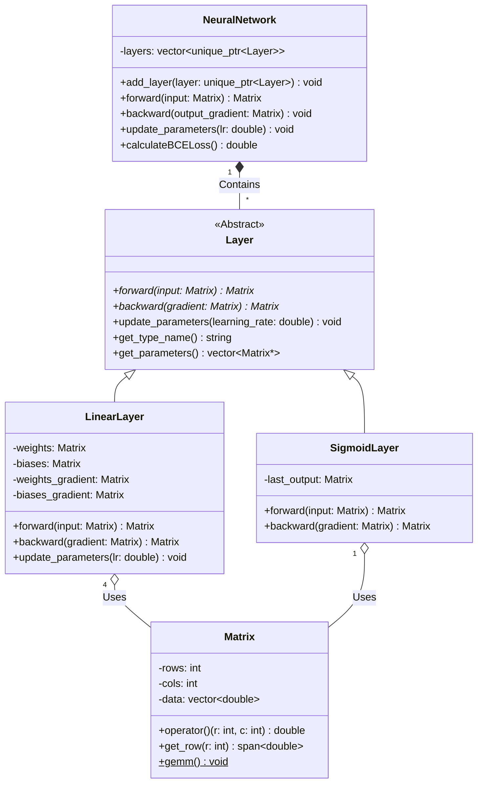
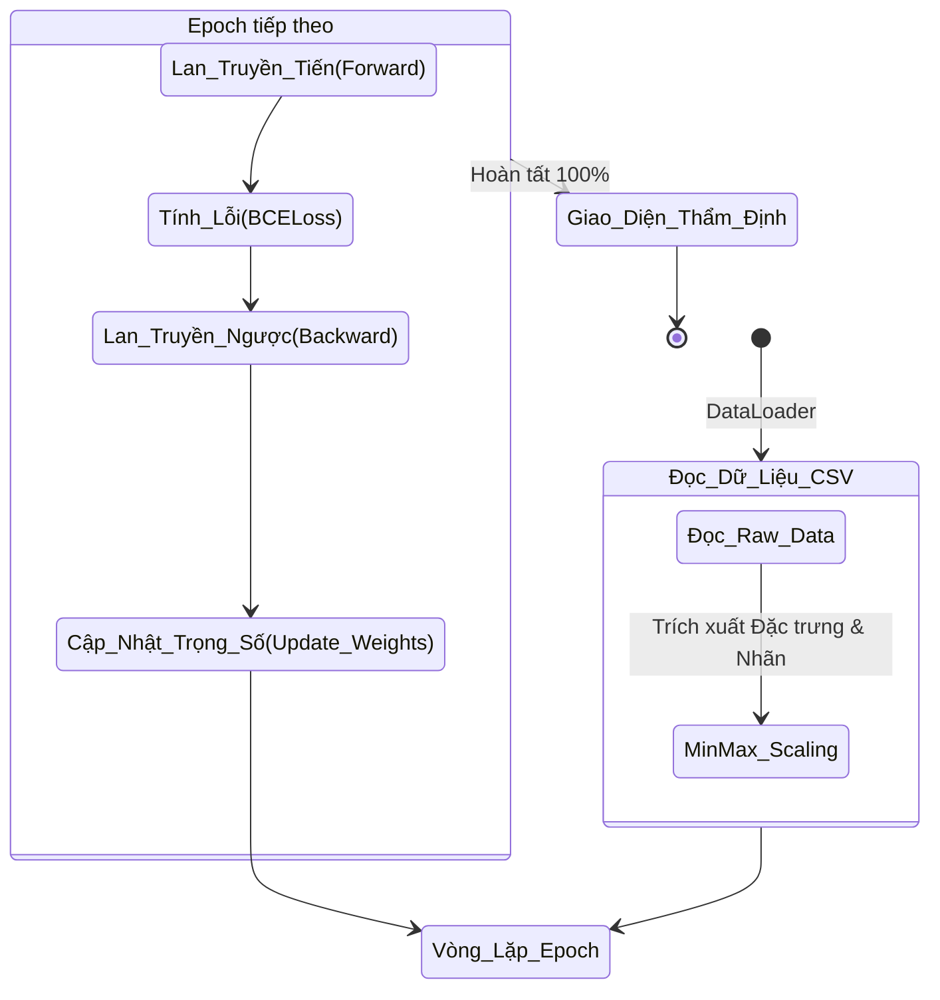

# RiskGuard ML Framework (v2.0)

**RiskGuard ML Framework** là một thư viện học máy (Machine Learning) toán học thuần túy, được tối ưu hóa bằng **C++20**, thiết kế chuyên biệt cho bài toán đánh giá rủi ro tín dụng (Credit Risk Assessment). Dự án tuân thủ nghiêm ngặt nguyên tắc **Zero-dependency** (100% offline, không phụ thuộc thư viện ngoài), đảm bảo tốc độ tính toán tối đa, quản lý bộ nhớ thủ công hiệu quả và bảo mật tuyệt đối.

---

## 🌟 Điểm Mạnh & Tính Năng Nổi Bật

Dự án sở hữu nhiều điểm kỹ thuật ấn tượng, thể hiện tư duy lập trình hệ thống mà nhóm đã cùng tìm tòi kết hợp học máy:

1. **Quản lý bộ nhớ tối ưu (Flat Memory Architecture):** Ma trận (`Matrix`) không dùng `std::vector<std::vector<double>>` (gây phân mảnh bộ nhớ) mà dùng mảng phẳng 1 chiều `std::vector<double> data`. Kỹ thuật này tối ưu hóa **CPU Cache**, giúp các phép toán ma trận nhanh hơn đáng kể.
2. **Thuật toán GEMM (General Matrix Multiply) Mini:** Phép nhân ma trận được viết tay, hỗ trợ tính toán *in-place* với cờ `transposeA` và `transposeB`, giảm thiểu việc khởi tạo vùng nhớ tạm thời trong quá trình backpropagation.
3. **Zero-copy Array Access:** Lấy dữ liệu từng hàng ma trận hoàn toàn không tốn chi phí copy nhờ `std::span`.
4. **Gradient Clipping & Numerical Stability:** Áp dụng `epsilon = 1e-15` để chống lỗi `NaN` khi tính đạo hàm Binary Cross Entropy, kết hợp chặn trần đạo hàm để tránh bùng nổ gradient.
5. **Xử lý đa luồng tự động:** Khai thác tập lệnh vector hóa (SIMD) của CPU bằng `std::execution::par_unseq`.

---

## 🚀 C++20 vs C++17: Sự đổi mới mà nhóm muốn mang tới

Việc nâng cấp từ C++17 lên **C++20** mang lại các lợi thế mang tính quyết định cho hiệu năng xử lý toán học:

* **`std::span` (Zero-copy View):** Trong C++17, để truyền một hàng của ma trận, ta thường phải copy ra `std::vector` mới, hoặc truyền con trỏ và kích thước thô (dễ gây lỗi bộ nhớ). C++20 `std::span` tạo ra một "khung nhìn" an toàn, chi phí bộ nhớ bằng `0`, giúp truy xuất dữ liệu tuyến tính với hiệu suất tối đa.
* **`std::execution::par_unseq`:** C++20 chuẩn hóa mạnh mẽ thư viện thực thi song song. Trong các hàm như `update_parameters` hay `elementwiseMultiply`, vòng lặp được tự động *vector hóa* và chạy song song trên nhiều lõi CPU, nhanh hơn hẳn vòng lặp tuần tự của C++17.
* **`[[nodiscard]]` tinh chỉnh:** Giúp compiler cảnh báo lập trình viên nếu quên gán kết quả của `forward()` hoặc `backward()`, một lỗi rất dễ mắc phải khi viết pipeline Deep Learning.

---

## 🏗️ Tư Duy Lập Trình Hướng Đối Tượng (OOP)

Dự án ứng dụng triệt để 4 tính chất của OOP để tạo ra một Framework dễ mở rộng:

1. **Tính Trừu Tượng (Abstraction):** 
   Lớp `Layer` là một Abstract Base Class (ABC) với các phương thức thuần ảo (`forward`, `backward`, `update_parameters`). Neural Network chỉ cần giao tiếp với `Layer` mà không cần biết bên dưới là Linear hay Sigmoid. Hệ thống `TestRunner` cũng ẩn đi logic thực thi nội bộ.
2. **Tính Đóng Gói (Encapsulation):**
   Lớp `Matrix` giấu kín mảng `data` một chiều (private) và thuật toán `r * cols + c`. Người dùng bên ngoài chỉ thao tác qua toán tử `operator()(r, c)`. Trạng thái bộ nhớ được bảo vệ an toàn.
3. **Tính Đa Hình (Polymorphism):**
   Trong hàm `NeuralNetwork::forward()`, vòng lặp gọi `layer->forward()`. Tại thời gian thực thi (Runtime), C++ sử dụng VTable để quyết định gọi `LinearLayer::forward` hay `SigmoidLayer::forward` tùy thuộc vào con trỏ thực tế.
4. **Tính Kế Thừa (Inheritance):**
   Các thuật toán (Linear, ReLU, Sigmoid) kế thừa thuộc tính và định nghĩa từ `Layer`. Các lớp kiểm thử (`MatrixMultiplicationTest`) kế thừa cấu trúc từ `TestCase`.

### Sơ Đồ Lớp (Class Diagram)



---

## 🔄 Luồng Dữ Liệu (Data Flow Activity)

Sơ đồ dưới đây mô tả cách hệ thống RiskGuard tiếp nhận dữ liệu và huấn luyện AI (Backpropagation Workflow):



---

## 💾 Kiến Trúc Serialize Dữ Liệu (Lý Thuyết Lưu Trữ JSON)

Để lưu trữ cấu trúc mạng nơ-ron ("bộ não AI") mà không phụ thuộc thư viện ngoài, việc sử dụng định dạng văn bản như **JSON (JavaScript Object Notation)** mang lại sự rõ ràng và dễ tương thích.

**Cách dữ liệu được định hình thành JSON:**
* **Kiến trúc phân cấp:** Mạng nơ-ron chứa một danh sách (Array) các Lớp (Layers). Mỗi lớp mang một cái tên (VD: `"Linear"`, `"Sigmoid"`).
* **Chuyển đổi Ma Trận thành Mảng JSON:** Lớp Linear chứa trọng số (`weights`) và độ lệch (`biases`). Vì kiến trúc `Matrix` của dự án sử dụng mảng phẳng (`vector<double>`), thay vì lưu thành mảng 2 chiều (Mảng lồng mảng), hệ thống chỉ cần lưu số hàng (`rows`), số cột (`cols`), và danh sách phẳng toàn bộ các số thực.

*Ví dụ minh họa cấu trúc JSON lưu trữ:*
```json
{
  "model": "RiskGuard_v2",
  "layers": [
    {
      "type": "Linear",
      "parameters": {
        "weights": { "rows": 4, "cols": 8, "data": [0.12, -0.45, 0.89, ...] },
        "biases": { "rows": 1, "cols": 8, "data": [0.01, -0.02, ...] }
      }
    },
    {
      "type": "Sigmoid",
      "parameters": {}
    }
  ]
}
```
**Quy trình Nạp (Deserialization):**
Chương trình sẽ đọc chuỗi ký tự, tìm kiếm các khóa `"rows"` và `"cols"` để tái cấp phát mảng bộ nhớ `Matrix`, sau đó nạp tuần tự danh sách các số thực vào vùng nhớ phẳng (Flat Memory) để tiếp tục tính toán tức thì.

---

## 📂 Cấu Trúc Thư Mục

```text
ML_Guard_OOP_GiuaKy/
├── CMakeLists.txt              # Cấu hình C++20 và Compiler target
├── README.md                   # Tài liệu thiết kế hệ thống
├── include/riskguard/          # Header files
│   ├── core/                   # Cốt lõi toán học (Matrix, Layer ABC)
│   ├── layers/                 # Các tầng mạng nơ-ron
│   └── utils/                  # Công cụ chuẩn hóa và UI Dashboard
├── src/                        # Implementation files (.cpp)
├── tests/                      # Testing Framework
└── data/                       # Dữ liệu tài chính
```

## 🛠️ Hướng Dẫn Cài Đặt (Installation)
Yêu cầu môi trường có hỗ trợ C++20 (GCC 11+ / MSVC 2019+).

```bash
# 1. Clone repository về máy cục bộ
git clone https://github.com/Yuno-20EA/ML_Guard_OOP_GiuaKy.git
cd ML_Guard_OOP_GiuaKy

# 2. Khởi tạo build
mkdir build && cd build

# 3. Cấu hình CMake
cmake ..

# 4. Biên dịch hệ thống kiểm thử
cmake --build . --target riskguard_tests

# 5. Chạy kiểm thử
./riskguard_tests
```

---

## 💻 Hướng Dẫn Sử Dụng (Usage)

Dưới đây là ví dụ minh họa cách khởi tạo pipeline đọc dữ liệu từ file CSV, đưa vào mạng nơ-ron huấn luyện:

```cpp
#include "riskguard/NeuralNetwork.hpp"
#include "riskguard/utils/DataLoader.hpp"

int main() {
    // 1. Khởi tạo mạng Nơ-ron cấu hình tuyến tính
    NeuralNetwork net(0.01); // Learning rate = 0.01
    net.add_layer(std::make_unique<LinearLayer>(4, 8));
    net.add_layer(std::make_unique<SigmoidLayer>());
    net.add_layer(std::make_unique<LinearLayer>(8, 1));
    net.add_layer(std::make_unique<SigmoidLayer>());

    // 2. Chạy Dashboard hoặc DataLoader tại đây...
    // net.train(X_norm, y, 1000); 
    
    return 0;
}
```

---

## 📜 Quy Tắc Quản Lý Kho Lưu Trữ (Repository Rules)

### 1. Chiến lược quản lý Nhánh (Branching Strategy)
* **Tuyệt đối không push trực tiếp lên nhánh `main` hoặc `master`.** Nhánh này phản ánh trạng thái production ổn định, chỉ chứa mã nguồn đã kiểm thử.
* Nhánh **`develop`** là nhánh trung tâm tích hợp. Mọi tính năng mới phải được gộp vào đây trước khi phát hành.
* Áp dụng **Feature Branching**. Tên nhánh tuân theo tiền tố:
  * `feature/ten-tinh-nang` (Ví dụ: `feature/csv-reader`)
  * `bugfix/ten-loi` (Ví dụ: `bugfix/fix-matrix-overflow`)

### 2. Quy chuẩn Commit (Commit Messages)
Thông điệp commit phải ngắn gọn, rõ nghĩa (áp dụng **Conventional Commits**):
```text
<loại>: <mô tả ngắn>
```
* `feat`: Thêm tính năng mới
* `fix`: Sửa lỗi
* `docs`: Cập nhật tài liệu (README)
* `style`: Định dạng mã nguồn

---

## 🤝 Quy Trình Đóng Góp & Duyệt Code (Contributing)

### Bước 1: Tạo Pull Request (PR)
Khi hoàn thành một tính năng, đẩy nhánh lên server và tạo Pull Request hướng về nhánh `develop`.
Đảm bảo code đã vượt qua bộ kiểm thử (`riskguard_tests`).

### Bước 2: Duyệt mã nguồn (Code Review)
Một PR chỉ đủ điều kiện gộp (merge) khi có ít nhất **1 thành viên khác** thẩm định cấu trúc, code style và bấm phê duyệt (**Approve**).

### Bước 3: Giải quyết Xung đột (Conflict Resolution)
Nếu có conflict, người tạo PR phải tự `git pull` nhánh `develop` về máy, giải quyết xung đột, chạy lại test trước khi yêu cầu review lại.

---

## 👥 Thành Viên & Vai Trò (Team Members)

Dự án được phát triển và phối hợp vận hành bởi các thành viên:

* **Nguyễn Hoàng Hải** – *Nhóm trưởng* - *MSV: 25112038*
  * Thiết lập kiến trúc hệ thống, cấu trúc thư mục chuẩn. Viết lõi tính toán C++20 (`Matrix`, `Layer`, `LinearLayer`, `SigmoidLayer`, `NeuralNetwork`).
* **Trần Đức Anh Minh** – *Thành viên* - *MSV: 25112085*
  * Thiết kế hệ thống lưu trữ/tải mô hình (`ModelManager`), cấu trúc hàm mất mát (`LossFunction`).
* **Bùi Trần Thu Trang** – *Thành viên* - *MSV: 25112114*
  * Phát triển công cụ tải và xử lý dữ liệu (`DataLoader`), thiết kế giao diện theo dõi huấn luyện (`Dashboard`).
* **Trần Ngọc Hiếu** – *Thành viên* - *MSV: 25112045*
  * Xây dựng framework kiểm thử tự động, viết các kịch bản test case đảm bảo độ chính xác thuật toán.
## Nguồn dữ liệu đến từ trang web : Kaggle.com - Dữ liệu được làm sạch bởi Hải    
